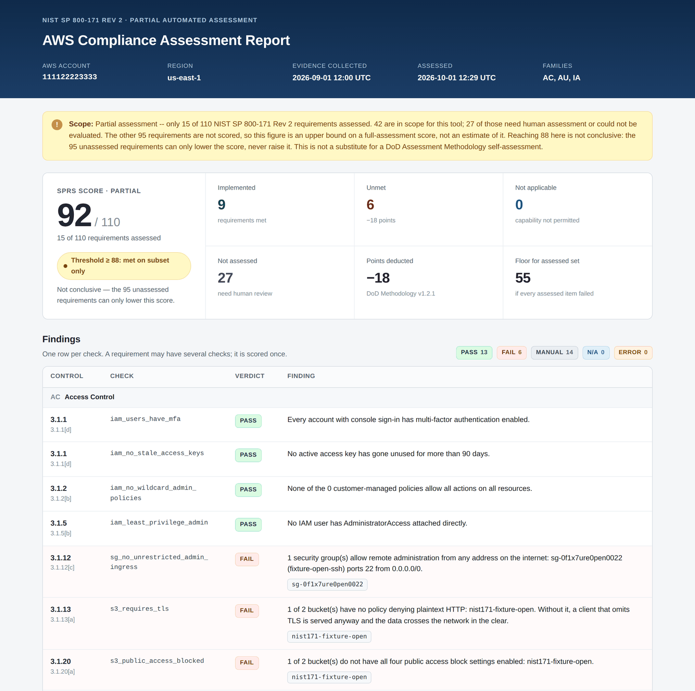
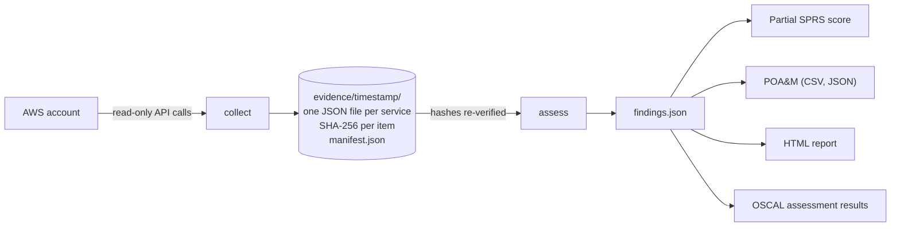

# nist171-collector

A Python command-line tool that inspects an AWS account with read-only API calls, checks it against the parts of NIST SP 800-171 Rev 2 that cloud configuration can prove, and produces hashed evidence, a partial SPRS score, a POA&M and OSCAL assessment results.



*The HTML report, generated from the hand-made sample evidence in `tests/fixtures/sample_evidence/` (a fictional account), so anyone can reproduce it without AWS.*

## What this does

- **Collects** IAM, CloudTrail, EC2, S3 and KMS configuration using read-only calls, and saves every response with a timestamp and a SHA-256 hash.
- **Assesses** that saved evidence against the Access Control (3.1), Audit and Accountability (3.3) and Identification and Authentication (3.5) families, giving each check a verdict of PASS, FAIL, MANUAL, NOT_APPLICABLE or ERROR.
- **Scores** the result under the DoD Assessment Methodology, keeping "not implemented" and "not assessed" strictly apart.
- **Reports** a self-contained HTML page, a POA&M (CSV and JSON) and an OSCAL 1.1.3 assessment-results document.

## Scope and limitations

This tool assesses **15 of the 110** NIST SP 800-171 Rev 2 requirements: the ones that can be verified through AWS control-plane APIs in the AC, AU and IA families. Of the 42 requirements in those families, 14 more get a MANUAL finding that tells a human assessor what to examine, and 13 have no check yet.

The other 68 requirements, and most of those 27, need evidence that no API returns: written policies and procedures, training records, physical security, personnel screening, or how people actually behave. Automated cloud inspection cannot see any of that.

So the score is a **partial assessment**. Requirements that were not assessed subtract nothing, which makes the number an upper bound: assessing more requirements can only lower it. A result below 88, the CMMC threshold for conditional Level 2 status, therefore means the threshold is not met; a result of 88 or more proves nothing on its own. It is not a substitute for a full self-assessment under the DoD Assessment Methodology.

Two automated checks state their own limits in their output: `iam_users_identified` (3.5.1) confirms that identities exist but not that each belongs to an authorized person, and `no_shared_accounts_heuristic` (3.3.2) judges shared accounts by name patterns only.

## Quick start

Requires Python 3.12. Collection needs an AWS profile whose credentials have the AWS managed `SecurityAudit` policy, which is read-only. The tool never accepts keys as arguments.

```powershell
git clone https://github.com/connor-p-mccune/nist171-collector.git
cd nist171-collector
python -m venv .venv
.\.venv\Scripts\Activate.ps1          # macOS/Linux: source .venv/bin/activate
pip install -r requirements.txt
pip install -e .

nist171 collect --profile nist-scanner   # writes evidence/<UTC timestamp>/
nist171 assess                           # newest evidence -> output/findings.json
nist171 report --format all              # HTML, POA&M, OSCAL into output/
```

On Windows, `.\run-all.ps1` runs all three steps and opens the report. To try it without an AWS account, point `assess` at the sample evidence:

```powershell
nist171 assess --evidence tests/fixtures/sample_evidence/20260901T120000Z
nist171 report --format all
```

`assess` also takes `--families` (for example `AC,IA`) and `--capability-not-permitted remote,wireless,mobile`. `report` takes `--poc` to name a point of contact on every POA&M item.

## How it works



Collection and assessment are separate on purpose. Collectors record what AWS said and make no judgments; checks read only saved evidence and never call AWS. The same evidence can be re-assessed later, and every check can be tested without an AWS account.

Evidence integrity is enforced, not assumed. Each item carries a SHA-256 of its canonical JSON, and `manifest.json` records a hash of every file. `assess` refuses evidence that no longer matches its hash, the HTML report prints the manifest hash, and the OSCAL output lists each evidence file with its hash. Missing or refused evidence always produces ERROR, never PASS.

## Requirement coverage

&dagger; Not applicable if the organization does not permit the capability (see Scoring). \* Partial credit defined by the methodology.

| ID | Requirement (short) | Points | 800-53 Rev 4 | Status | Checks |
|---|---|---|---|---|---|
| 3.1.1 | Limit access to authorized users | 5 | AC-2, AC-3, AC-17 | Automated | `iam_users_have_mfa`<br>`iam_no_stale_access_keys` |
| 3.1.2 | Limit access to permitted functions | 5 | AC-2, AC-3, AC-17 | Automated | `iam_no_wildcard_admin_policies` |
| 3.1.3 | Control the flow of CUI | 1 | AC-4 | Manual | `cui_flow_control_manual` |
| 3.1.4 | Separate duties | 1 | AC-5 | Manual | `separation_of_duties_manual` |
| 3.1.5 | Least privilege | 3 | AC-6, AC-6(1), AC-6(5) | Automated | `iam_least_privilege_admin` |
| 3.1.6 | Non-privileged accounts for non-security work | 1 | AC-6(2) | Not yet | — |
| 3.1.7 | Restrict and log privileged functions | 1 | AC-6(9), AC-6(10) | Manual | `privileged_function_control_manual` |
| 3.1.8 | Limit unsuccessful logons | 1 | AC-7 | Not yet | — |
| 3.1.9 | Privacy and security notices | 1 | AC-8 | Not yet | — |
| 3.1.10 | Session lock | 1 | AC-11, AC-11(1) | Not yet | — |
| 3.1.11 | Session termination | 1 | AC-12 | Not yet | — |
| 3.1.12 | Monitor and control remote access | 5&dagger; | AC-17(1) | Automated | `sg_no_unrestricted_admin_ingress` |
| 3.1.13 | Encrypt remote access sessions | 5&dagger; | AC-17(2) | Automated | `s3_requires_tls` |
| 3.1.14 | Route remote access through managed points | 1 | AC-17(3) | Not yet | — |
| 3.1.15 | Authorize remote privileged commands | 1 | AC-17(4) | Not yet | — |
| 3.1.16 | Authorize wireless access | 5&dagger; | AC-18 | Not yet | — |
| 3.1.17 | Protect wireless access | 5&dagger; | AC-18(1) | Not yet | — |
| 3.1.18 | Control mobile devices | 5&dagger; | AC-19 | Not yet | — |
| 3.1.19 | Encrypt CUI on mobile devices | 3 | AC-19(5) | Not yet | — |
| 3.1.20 | Control connections to external systems | 1 | AC-20, AC-20(1) | Automated | `s3_public_access_blocked` |
| 3.1.21 | Limit portable storage on external systems | 1 | AC-20(2) | Not yet | — |
| 3.1.22 | Control CUI on public systems | 1 | AC-22 | Not yet | — |
| 3.3.1 | Create and retain audit logs | 5 | AU-2, AU-3, AU-3(1), AU-6, AU-12 | Automated | `cloudtrail_enabled_multiregion` |
| 3.3.2 | Trace actions to individual users | 3 | AU-2, AU-3, AU-3(1), AU-6, AU-12 | Automated | `cloudtrail_global_events`<br>`no_shared_accounts_heuristic` |
| 3.3.3 | Review and update logged events | 1 | AU-2(3) | Manual | `logged_events_review_manual` |
| 3.3.4 | Alert on audit logging failure | 1 | AU-5 | Manual | `audit_failure_alerting_manual` |
| 3.3.5 | Correlate audit review and reporting | 5 | AU-6(3) | Manual | `audit_correlation_manual` |
| 3.3.6 | Audit reduction and reporting | 1 | AU-7 | Manual | `audit_reduction_manual` |
| 3.3.7 | Synchronize clocks for timestamps | 1 | AU-8, AU-8(1) | Manual | `time_synchronization_manual` |
| 3.3.8 | Protect audit information | 1 | AU-9 | Automated | `cloudtrail_log_validation`<br>`cloudtrail_bucket_protected` |
| 3.3.9 | Limit who manages audit logging | 1 | AU-9(4) | Manual | `audit_management_access_manual` |
| 3.5.1 | Identify users, processes and devices | 5 | IA-2, IA-5 | Automated | `iam_users_identified` |
| 3.5.2 | Authenticate users, processes and devices | 5 | IA-2, IA-5 | Automated | `password_policy_exists` |
| 3.5.3 | Multifactor authentication | 5* | IA-2(1), IA-2(2), IA-2(3) | Automated | `mfa_privileged_users`<br>`mfa_all_users` |
| 3.5.4 | Replay-resistant authentication | 1 | IA-2(8), IA-2(9) | Manual | `replay_resistant_auth_manual` |
| 3.5.5 | Prevent identifier reuse | 1 | IA-4 | Manual | `identifier_reuse_manual` |
| 3.5.6 | Disable inactive identifiers | 1 | IA-4 | Manual | `identifier_disable_manual` |
| 3.5.7 | Password complexity | 1 | IA-5(1) | Automated | `password_complexity` |
| 3.5.8 | Prohibit password reuse | 1 | IA-5(1) | Automated | `password_reuse` |
| 3.5.9 | Temporary passwords changed at first use | 1 | IA-5(1) | Manual | `temporary_password_manual` |
| 3.5.10 | Store and transmit only protected passwords | 5 | IA-5(1) | Automated | `no_root_access_keys` |
| 3.5.11 | Obscure authentication feedback | 1 | IA-6 | Manual | `obscure_feedback_manual` |

## Scoring

Scoring follows the *NIST SP 800-171 DoD Assessment Methodology, Version 1.2.1, June 24, 2020*:

- Start at 110. For each requirement that is not implemented, subtract its Annex A weight of 5, 3 or 1 points. A requirement with several failing checks is deducted once.
- A requirement counts as implemented only if every check on it passes. If it has no check, or any check is MANUAL or ERROR and none fails, it is **not assessed**: it is listed separately and never counted as a pass.
- **Not applicable:** the methodology says not to deduct for 3.1.12 and 3.1.13 if remote access is not permitted, for 3.1.16 and 3.1.17 if wireless access is not permitted, or for 3.1.18 if mobile device connections are not permitted. The tool scores these as N/A only when you declare it with `--capability-not-permitted`, and warns if the evidence contradicts the declaration.
- **3.5.3 partial credit:** the methodology deducts 3 points instead of 5 when MFA is implemented for remote and privileged users but not general users. Every AWS console sign-in is remote access, so an account without MFA is always a remote account without MFA, and the tool deducts the full 5. The scoring engine still supports per-finding deductions for partial-credit rules that a check can establish.
- The score is not clamped at zero, and the lowest possible score for the assessed subset is reported alongside it.

Against the deliberately non-compliant Terraform environment in `terraform/`, the tool reports **82 / 110 with 15 of 110 requirements assessed**: 8 unmet requirements, 7 implemented, 27 not assessed. `terraform/EXPECTED.md` lists the result expected for every resource. Two of its rows also show why mocks are not enough: AWS turned on S3 encryption and Block Public Access for new buckets by default in 2023, and `moto` does not emulate either change.

## Regulatory context (as of October 1, 2026)

**Why Rev 2.** NIST superseded SP 800-171 Rev 2 with Rev 3 in May 2024, but DoD class deviation 2024-O0013 kept Rev 2 as the requirement under DFARS 252.204-7012, and current DoD guidance still requires Rev 2. Contractors are assessed against Rev 2, so this tool targets Rev 2.

**CMMC.** On July 13, 2026, DoD's Chief Information Officer suspended CMMC Phase 2 (the third-party certification requirements due to take effect in November 2026) pending a 60-day reform review. At the time of writing, Phase 2 remains suspended. Self-assessment against 800-171 Rev 2 still applies: DFARS 252.204-7012 is unchanged, and contractors still need a current SPRS score under DFARS 252.204-7019 and 7020. Submitting an inaccurate score continues to carry False Claims Act risk, which is why this tool never lets "not assessed" become "passed".

**OSCAL.** Federal compliance is moving from documents to data. OMB memo M-24-15 directed agencies' GRC tools to ingest and produce authorization artifacts in OSCAL by July 2026, and FedRAMP is retiring Word and Excel as package formats in favor of structured, text-based data. This tool writes OSCAL so its results can be loaded by those tools rather than retyped. See `docs/oscal.md` for the structure and how to validate it.

## Related tools

[Prowler](https://github.com/prowler-cloud/prowler) already ships a NIST SP 800-171 Rev 2 mapping for AWS with far more checks than this project, and AWS Security Hub CSPM offers a Rev 2 standard that runs on AWS Config. This project is not trying to replace either. What it adds is DoD-methodology SPRS scoring with explicit handling of unassessed requirements, SHA-256 hashed evidence with a manifest, POA&M generation with the CMMC 180-day timeline and deferral rules, and OSCAL assessment-results output. It needs only read-only API access and enables no paid AWS services.

## Development

```powershell
pip install -r requirements-dev.txt
pytest --cov      # 401 tests, coverage report, fails below 80%
ruff check .      # lint: line length 100, rule sets E, F, I, UP
mypy              # type check of src/
```

Tests run against `moto`, an in-memory AWS mock, and a hand-made evidence set, so no test can reach a real account. Coverage is currently about 95%.

```
catalog/        controls.yaml (all 110 requirements, Annex A points) and objectives.yaml (SP 800-171A)
src/nist171/    collectors/aws, checks (ac, au, ia), scoring/sprs.py, reporting (html, poam, oscal)
terraform/      deliberately non-compliant test environment and EXPECTED.md
tests/          unit, CLI and pipeline tests, plus fixtures
docs/           OSCAL notes and source documents
```

## Roadmap

- Collect CloudWatch alarms and metric filters so 3.3.4 (alert on audit logging failure) can be checked automatically.
- Compare two evidence runs and report drift, using the stable per-resource identifiers already in the OSCAL output.
- Add the System and Communications Protection family (3.13), including the 3.13.11 partial-credit rule.

## Sources

- [NIST SP 800-171 Rev 2](https://csrc.nist.gov/pubs/sp/800/171/r2/upd1/final), Protecting CUI in Nonfederal Systems and Organizations
- [NIST SP 800-171A](https://csrc.nist.gov/pubs/sp/800/171/a/final), Assessing Security Requirements for CUI
- [NIST SP 800-171 DoD Assessment Methodology, Version 1.2.1](https://www.acq.osd.mil/asda/dpc/cp/cyber/docs/safeguarding/NIST-SP-800-171-Assessment-Methodology-Version-1.2.1-6.24.2020.pdf)
- [OSCAL assessment-results model, v1.1.3](https://pages.nist.gov/OSCAL-Reference/models/v1.1.3/assessment-results/json-outline/)
- [AWS managed policy: SecurityAudit](https://docs.aws.amazon.com/aws-managed-policy/latest/reference/SecurityAudit.html)
